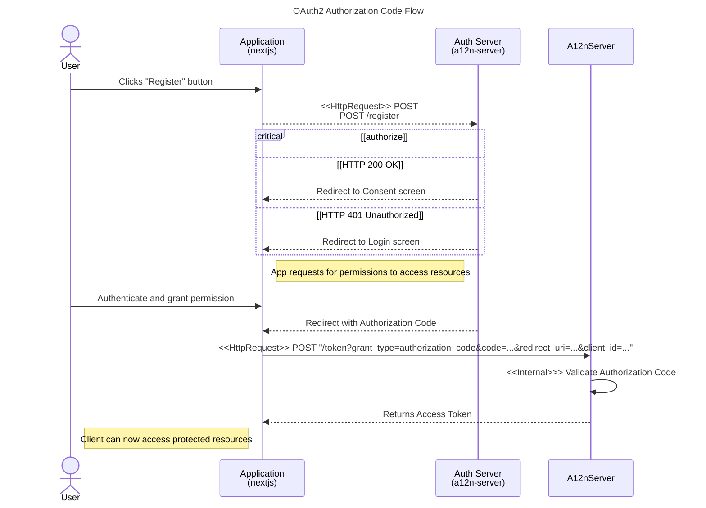

# Authorization Code Flow

The OAuth 2.0 Authorization Code Flow is one of three grant types of OAuth2 that enables an application to access data on a user's behalf.
This allows an application to selectively receive more sensitive, opt-in information about a user.

For more detailed information about the Authorization Code Flow, see the [OAuth2 RFC](https://www.rfc-editor.org/rfc/rfc6749.html) 

Currently, `a12n-server`'s' authorization code flow provides access tokens for the following requests:

...
...
...


The Authorization Code Flow has two main steps: the authorization code request and the access token request.



1. The client application redirects the user to the authorization server.

```
POST /authorize
      ?response_type=code
      &scope=<scope>
      &state=<state>
      &redirect_uri=<redirect_uri>
      &client_id=<client_id>
```

1. The authorization server redirects the user back to the client application with an authorization code.
2. The client application exchanges the authorization code for an access token.
```
POST /token
        ?grant_type=authorization_code
        &code=<authorization_code>
        &redirect_uri=<redirect_uri>
        &client_id=<client_id>
        &client_secret=<client_secret>
```
3. The client application can now access the user's data.
4. The access token can be used to make requests to the API.

## Access Token Request

```sh
    curl -X POST https://localhost:8351/token
    -u <client_id>:<client_secret>
    -d redirect_uri=<redirect URI used in authorize request>
    -d grant_type=authorization_code
    -d code=<authorization_code>
```

## Get a user's account info

```sh
    curl -X GET https://localhost:8351/user/:userId
    -H "Authorization Bearer <access_token>"
```