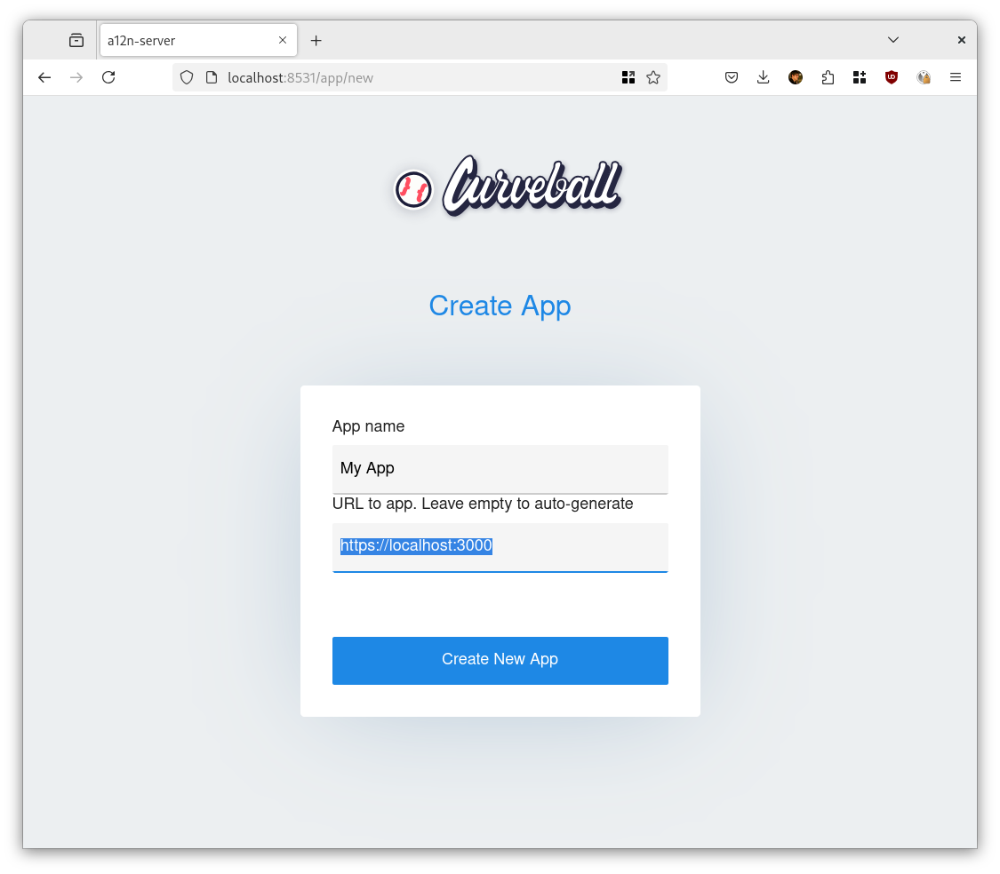
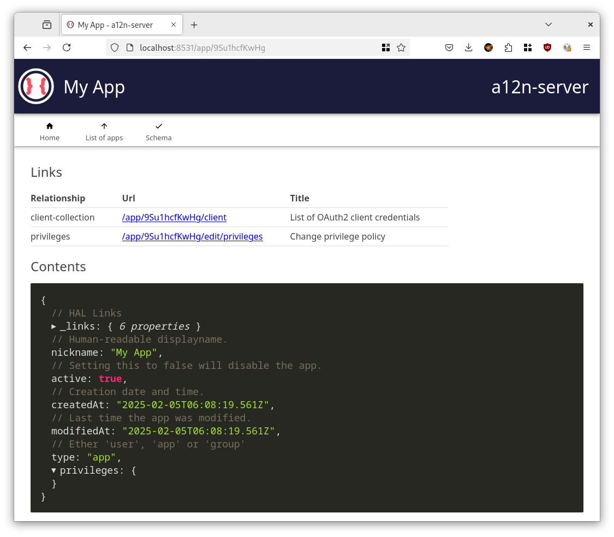
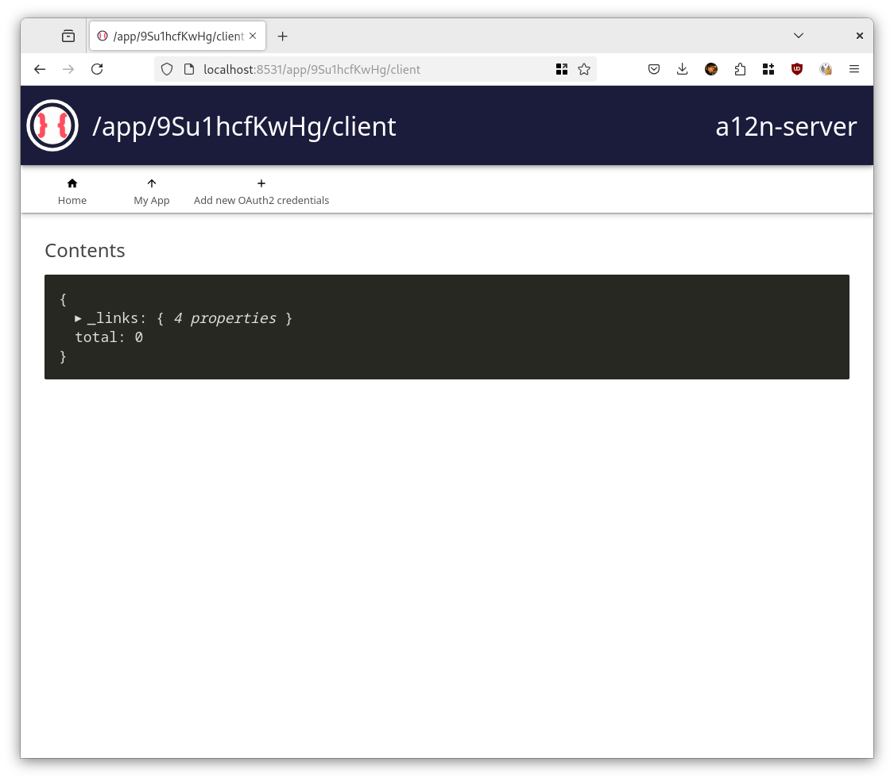
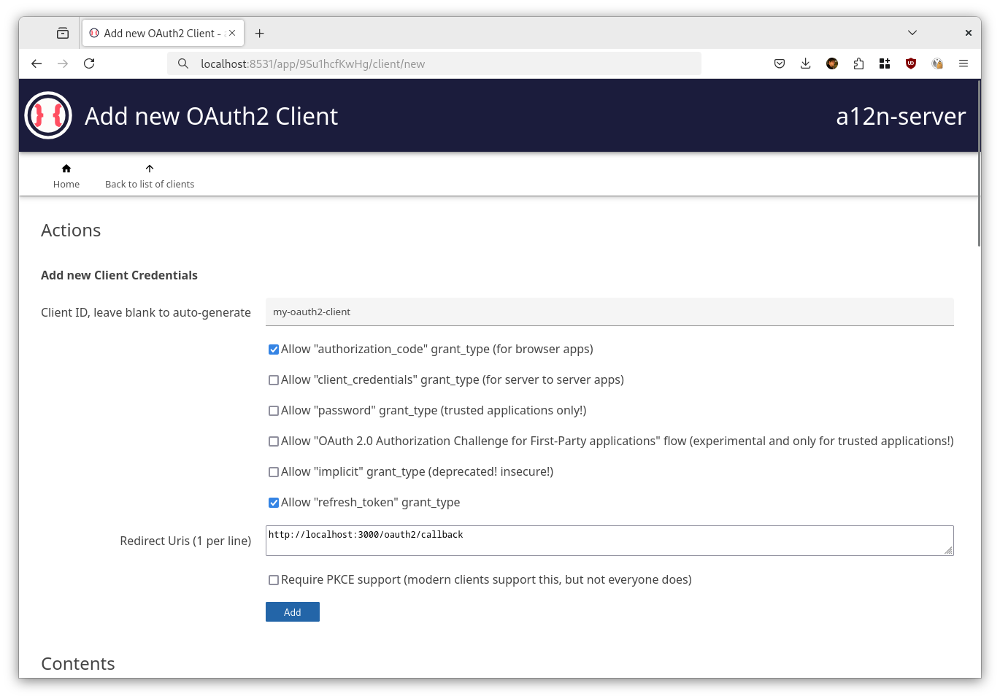
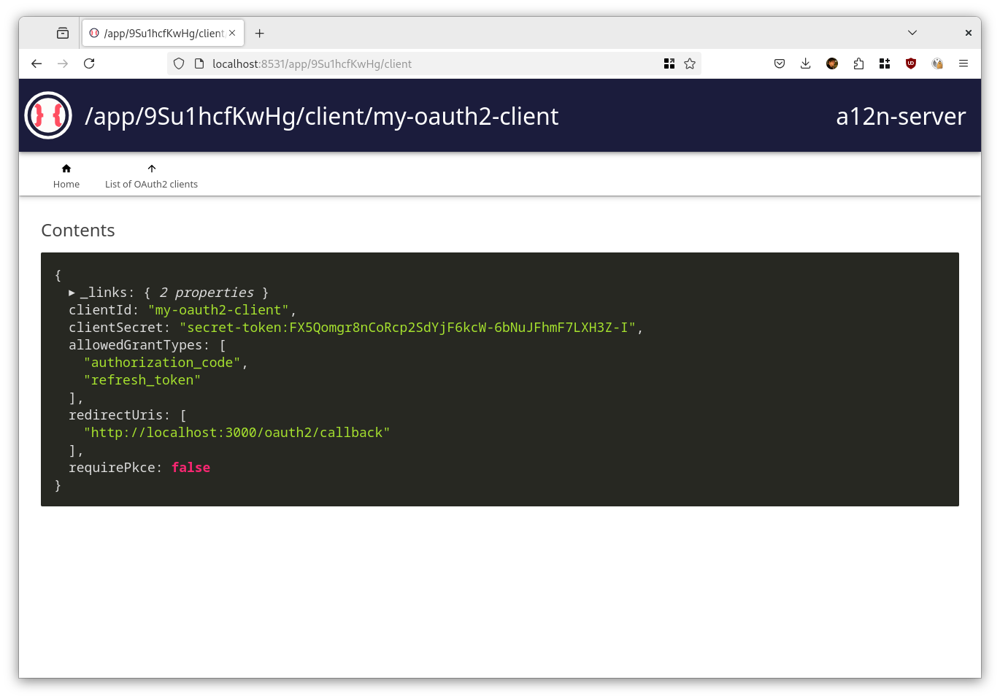

Integrating your app with a12n-server
=====================================

The main use-case for a12n-server is handle authentication of users in your
application, so you don't have to write basic features such as storing users,
checking passwords.

The best place to start is setting up login from your application. There are a
few ways to do this, with varying degree of customization, but the simplest way
is use the [OAuth2 authorization code flow][1], with or without the OpenID
Connect extensions.

The way this roughly works is that the user will (for example) click a login
button in your app, which will redirect them to the a12n-server login page.
After they log in, they will be redirected back to your app with an authorization
code, which your app can then exchange for an access token.

While you can implement this yourself, you are strongly recommended to simply use
an off-the-shelf OAuth2 or OpenID Connect library for your language/framework.
Generally the more specific to your framework the library is, the smoother
the integration will work.

For example, if you are using Django, you can use the [`django-oauth-toolkit`][2],
and if you use Next.js, consider using [`next-auth`][3].

Check out the <https://oauth.net/code/> for a list of libraries.

### What information do you need?

Typically you will need some or more of the following to integrate with OAuth2:

* Authorization endpoint: `http://your-a12n-server/authorize`
* Token endpoint: `http://your-a12n-server/token`
* Client ID
* Client Secret (only needed for server-side integrations, skip this if you are
  integrating with a SPA).

If you use OpenID Connect, often it will not ask for an issuer, which is simply
the base URL of your a12n-server.

### How do you get the Client ID and Client Secret?

To get these values, head over to the a12n-server admin interface and create
a new 'App'.

The first screen will ask for a name and a URL. Both are these are informational
and help you identify your app later.

After this, you'll see a screen like the following with the information you
just enterered:

After this, you need to create a new 'Client' for your app. To do so, click on
the 'client-collection' link, which leads you to this screen:

From there, you can create a new client by 'Add new OAuth2 credentials'.

This last form will ask you for a few things:

First, you can pick the 'client id'. If you don't fill this in a random string
will be generated for you.

You also need to choose `refresh_token` and `authorization_code` grant types
for this flow to work.

Lastly, you need to enter a Redirect URI. This URL will likely be specific to your
OAuth2 integration on the app side. If you don't know what this is yet, you can
skip this and come back to it later to fix. For `next-auth` this might for example
be: `http://localhost:3000/api/auth/callback/a12n-server`, where `localhost:3000`
refers to your local Next.js development environment.

PKCE is optional, but if you know your client supports it, you should enable it
for additional security.

Submitting this form leads you to a screen with your client ID and client secret.
The client-secret is only shown once, so make sure to copy it somewhere safe.

[1]: https://developer.okta.com/blog/2018/04/10/oauth-authorization-code-grant-type
[2]: https://django-oauth-toolkit.readthedocs.io/en/latest/
[3]: https://next-auth.js.org/

